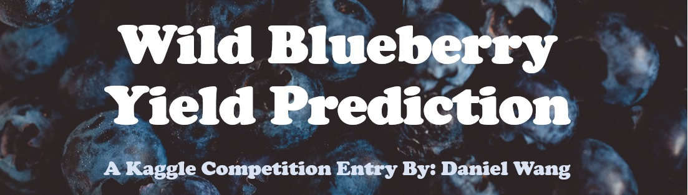

# Hackathon - Wild Blueberry Yield Prediction (Kaggle Competition)

# 

## Problem Statement

A [Kaggle competition data](https://www.kaggle.com/datasets/shashwatwork/wild-blueberry-yield-prediction-dataset) was held to create a predictive model for wild blueberry "crop" yield based on factors/variables such as the amount of rain, temperature, number of bees, etc.

---
## Executive Summary

Using [Kaggle competition data](https://www.kaggle.com/datasets/shashwatwork/wild-blueberry-yield-prediction-dataset), 

A number of machine learning models (and the weights of variables) were evaluated, including: Linear Regression, Decision Tree, Random Forest, Bagged Decision Trees, GradientBoost, AdaBoost, XGBoost, and K Nearest Neighbors.  Models were optimized using primarily RandomSearch, but GridSearch is used selectively (for comparison purposes) as well.  Top performing models were ensembled using Voting Regressor to produce a final predictive model.

The PyCaret library is also demonstrated, which offers "single-line" evaluation of many different regressors.

Predictions from both the self-ensembled model and the PyCaret model were submitted to Kaggle.  Ultimately, the PyCaret model performed better (had shorter execution time and produced higher scoring results) than the "traditional" ensembled counterpart.

Key results are as follow:

---
## Data Dictionary

|Data Label|Unit|dtype|Description|
|---|---|---|---|
|name|IMDb|object(str)|'My Hero Academia'|
|href|IMDb|object(str)|'/title/tt5626028/'|
|years|IMDb|object(str)|'(2016– )'|
|imdb_description|IMDb|object(str)|'A superhero-loving boy without any powers is d...'|
|pg_rating|IMDb|object(str)|'TV-14'|
|imdb_genre_tags|IMDb|object(pandas series)|Animation, Action, Adventure|

|Clonesize|m2|float64|The average blueberry clone size in the field|
|Honeybee|bees/m2/min|float64|Honeybee density in the field|
|Bumbles|bees/m2/min|float64|Bumblebee density in the field|
|Andrena|bees/m2/min|float64|Andrena bee density in the field|
|Osmia|bees/m2/min|float64|Osmia bee density in the field|
|MaxOfUpperTRange|℃|float64|The highest record of the upper band daily air temperature during the bloom season|
|MinOfUpperTRange|℃|float64|The lowest record of the upper band daily air temperature|
|AverageOfUpperTRange|℃|float64|The average of the upper band daily air temperature|
|MaxOfLowerTRange|℃|float64|The highest record of the lower band daily air temperature|
|MinOfLowerTRange|℃|float64|The lowest record of the lower band daily air temperature|
|AverageOfLowerTRange|℃|float64|The average of the lower band daily air temperature|
|RainingDays|Day|float64|The total number of days during the bloom season, each of which has precipitation larger than zero|
|AverageRainingDays|Day|float64|The average of raining days of the entire bloom season|
|fruitset|(units not given)|float64|(no description given)|
|fruitmass|(units not given)|float64|(no description given)|
|seeds|(units not given)|float64|(no description given)|
|yield|(units not given)|float64|Wild blueberry yield (the prediction target)|

---
## Methodology

### Model Descriptions

##### Model 1: 

##### Model 2:

##### Model 3:

##### Model 4:

##### Model 5:

---
## Results/Primary Findings

|Model Type|Train or Test|Score|
|---|---|---|
|Linear regression |Training|0.8099181538889013|
|Linear regression |Testing|0.8104766968969612|
|---|
|Decision Tree regressor |Training|0.8413953540407101|
|Decision Tree regressor |Testing|0.7635734649315802|
|Random Searched Decision Tree|Training|0.754918242806616|
|Random Searched Decision Tree|Testing|0.7447592285113995|
|---|---|---|
|Random Forest regression |Training|0.9617538186347514|
|Random Forest regression |Testing|0.7987079248010366|
|Random Searched Random Forest|Training|0.8534238909887624|
|Random Searched Random Forest|Testing|0.8264464477824622|
|---|---|---|
|Bagging regressor |Training|0.9628280605699523|
|Bagging regressor |Testing|0.7951080646883156|
|Random Searched Bagged Decision Tree|Training|0.8193138844282389|
|Random Searched Bagged Decision Tree|Testing|0.7906932357006674|
|---|---|---|
|Adaboost regressor |Training|0.7336949896527206|
|Adaboost regressor |Testing|0.7292821690509237|
|Random Searched Adaboost|Training|0.7949444153264841|
|Random Searched Adaboost|Testing|0.7995397421933199|
|---|---|---|
|GradientBoost regressor |Training|0.8472589951109507|
|GradientBoost Tree regressor |Testing|0.8252494142671271|
|Random Searched Gradientboost|Training| 0.8392617945130856|
|Random Searched Gradientboost|Testing|0.8254481161219985|
|---|---|---|
|KNN regressor |Training|0.8293788914372683|
|KNN Tree regressor |Testing|0.7472037517704027|
|Random Searched KNN|Training|0.999994517331852|
|Random Searched KNN|Testing|0.7677358435145182|
|---|---|---|
|XGBoost |Training|0.8281530191191618|
|XGBoost |Testing|0.8026802685061007|
|Random Searched XGBoost|Training|0.999994517331852|
|Random Searched XGBoost|Testing|0.7677358435145182|
|---|---|---|
|Ensembled |Training|0.8389627674720598|
|Ensembled |Testing|0.8253880697825744|

---
## Sources & References

1. https://www.kaggle.com/datasets/shashwatwork/wild-blueberry-yield-prediction-dataset
2. (Original data) Efrem Yohannes Obsie, Hongchun Qu, Francis Drummond. "Plant spatial traits, bee species composition, and weather conditions dataset for wild blueberry yield prediction through computer simulation modeling and machine learning algorithms." https://data.mendeley.com/datasets/p5hvjzsvn8/1
